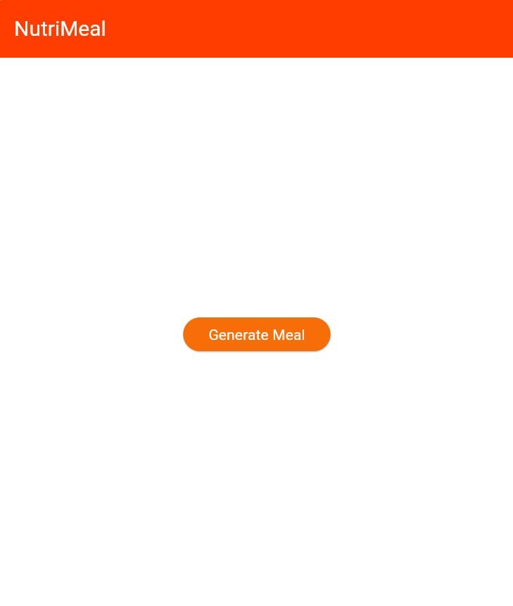
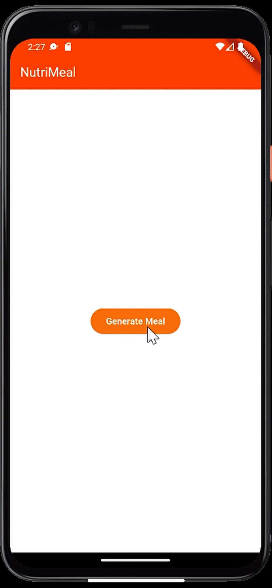
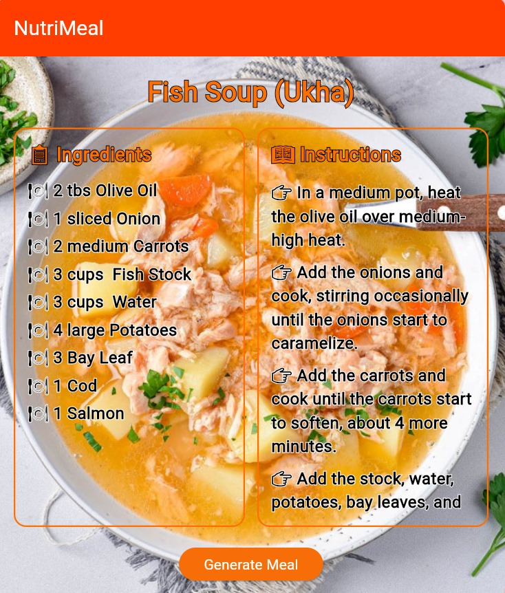
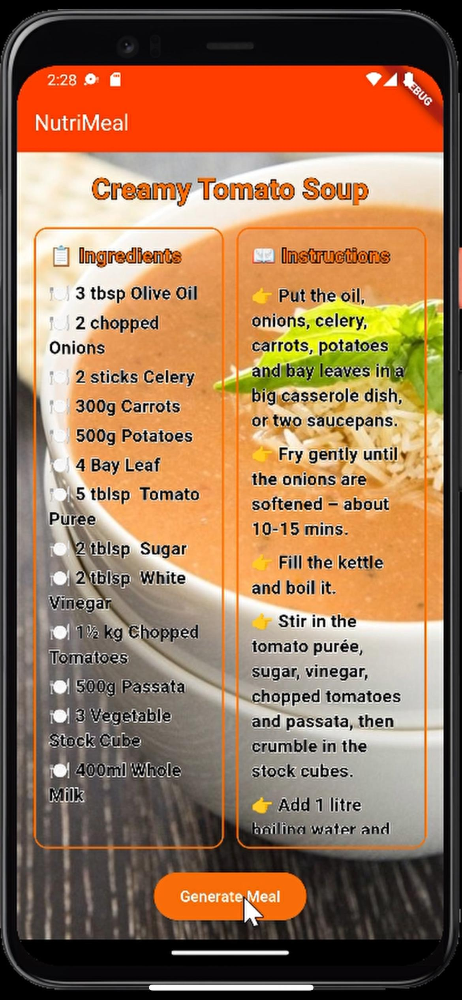

# 🍽️ NutriMeal — Flutter Recipe Generator App

Welcome to **NutriMeal**, a simple yet powerful Flutter Web & Android application that helps you decide *what to cook today*!  
With over **300+ international meals** — from spicy Asian cuisine to warm European dishes — this app is made for anyone who’s ever asked:  
**"What should I eat today?"**

---

> ✨ *"Don't know what to cook? Let NutriMeal decide for you!"*

---

## 🚀 Features

- 🔀 Randomly generate meals from 300+ international recipes
- 🌐 Works on **Web** and 📱 **Android**
- ⚙️ Built with **Flutter** & **Dart**
- ☁️ Deployed via **Firebase Hosting**
- ⚡ Automated deployment using **GitHub Actions**
- 🔓 No authentication or API key needed (powered by [TheMealDB](https://www.themealdb.com/))

---

## 💡 Use Case

NutriMeal is perfect for:

- 🤯 People who are stuck figuring out what to cook
- 🧠 Creatives needing food inspiration
- 👨‍🍳 Cooking hobbyists trying new global cuisines

---

## 🛠️ Tech Stack

| Layer       | Technology           |
|-------------|----------------------|
| Framework   | Flutter              |
| Language    | Dart                 |
| Deployment  | Firebase Hosting     |
| CI/CD       | GitHub Actions       |
| API         | [TheMealDB](https://www.themealdb.com/api.php) (Free & Open) |

---

## 🧪 How It Works

1. Press the **"Generate Recipe"** button.
2. App calls TheMealDB API for a random meal.
3. It shows:
   - 🍲 Meal name
   - 📷 Meal image
   - 📋 Instructions
   - 🍴 Ingredients & Measurements

---

## 📸 Screenshots

| Web View                                | Mobile View                              |
|------------------------------------------|-----------------------------------------------------|
|     |      |
|   |    |

---

## 🧭 Getting Started (for Developers)

git clone https://github.com/yourusername/nutrimeal-flutter-recipe-generator.git
cd nutrimeal-flutter-recipe-generator
flutter pub get
flutter run -d chrome # or -d android
